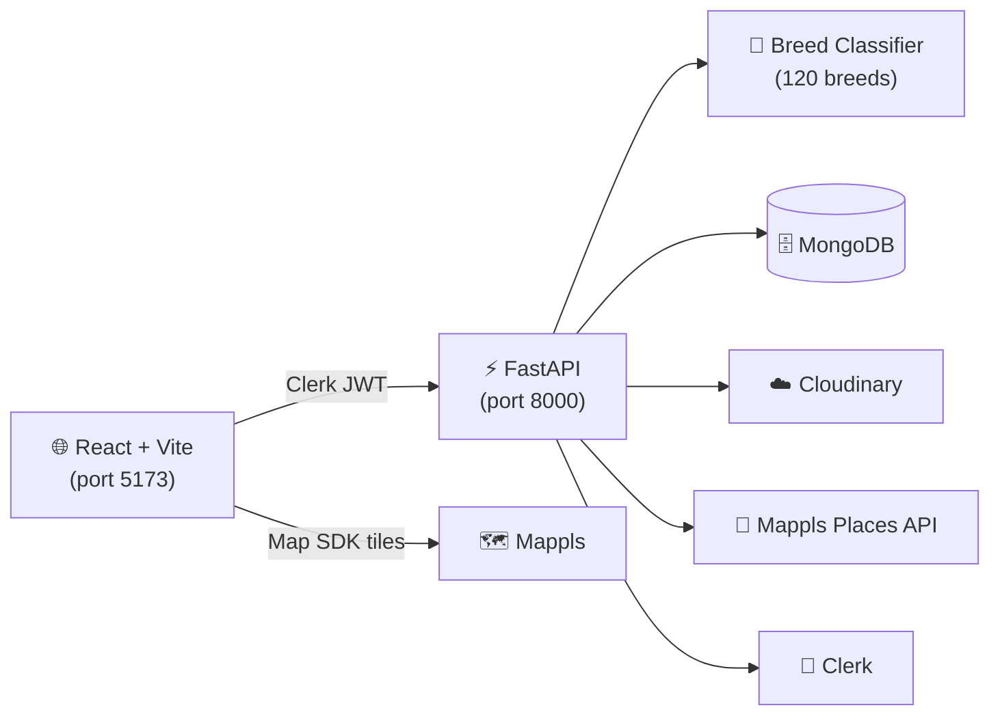
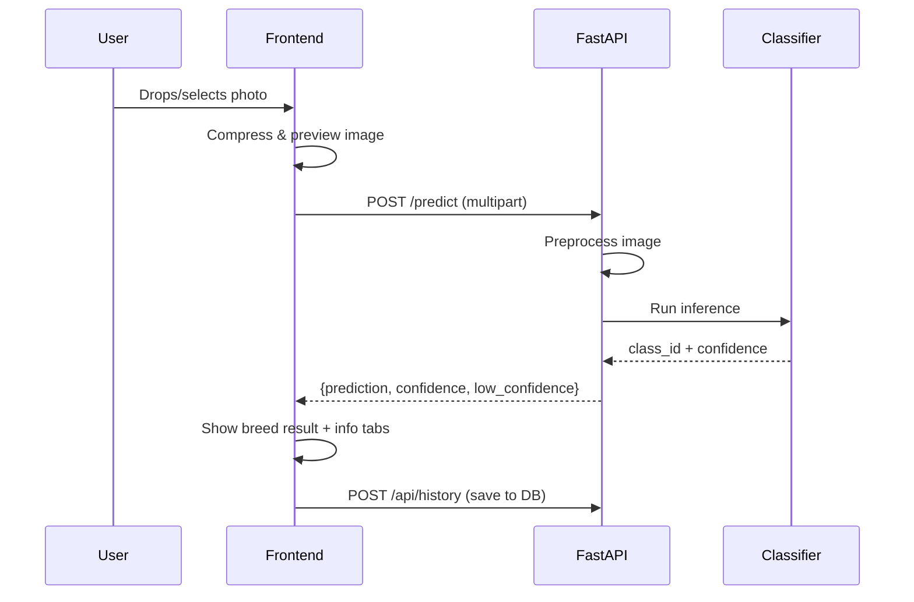
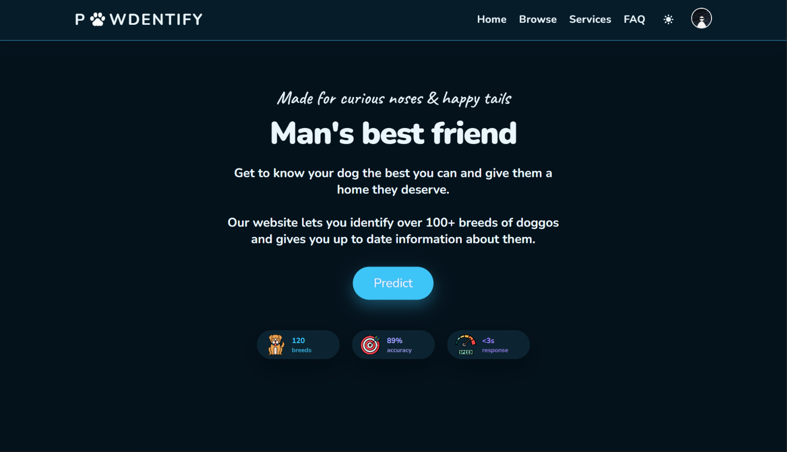
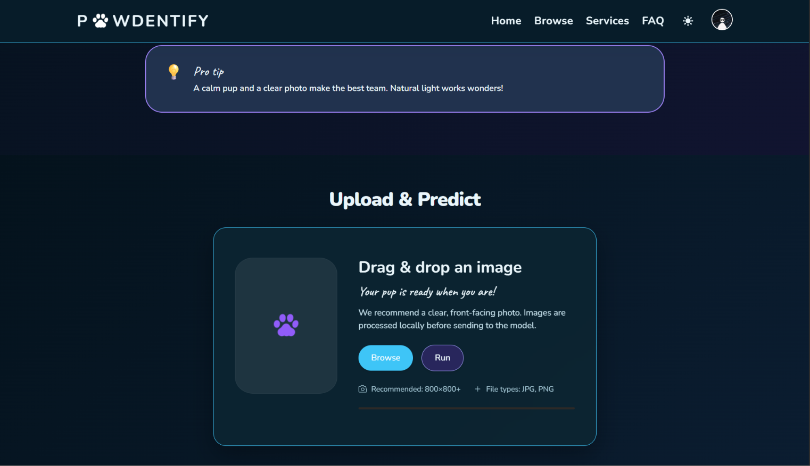
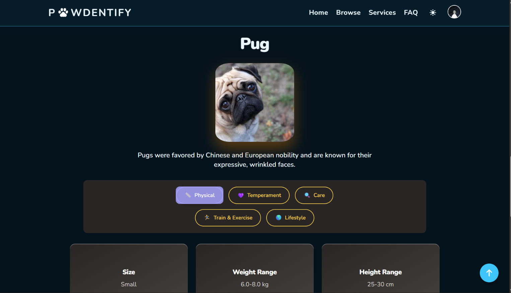
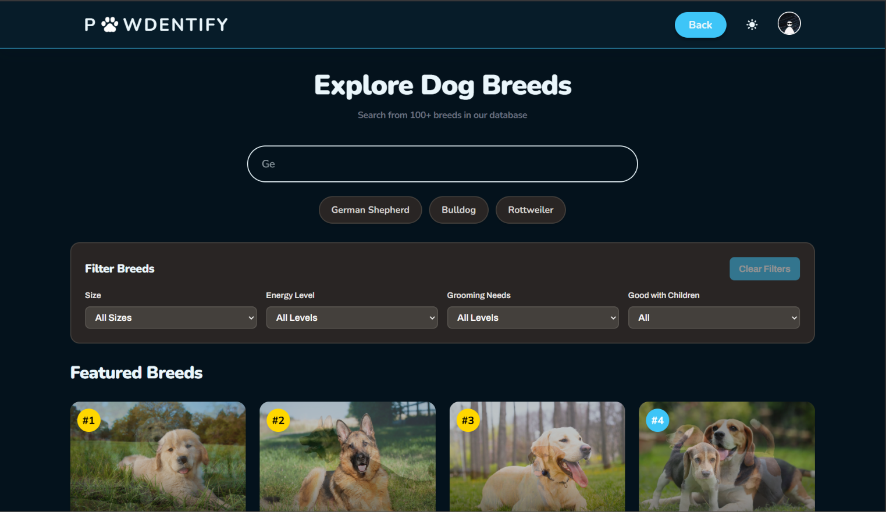
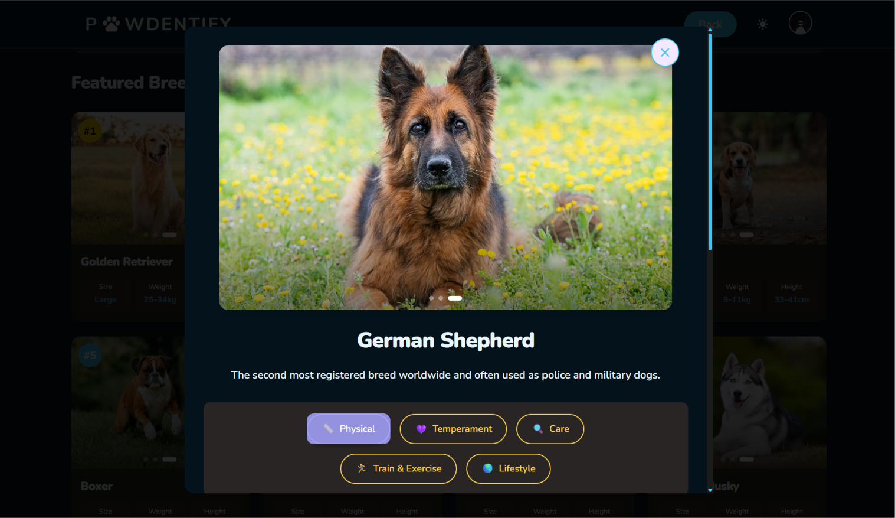
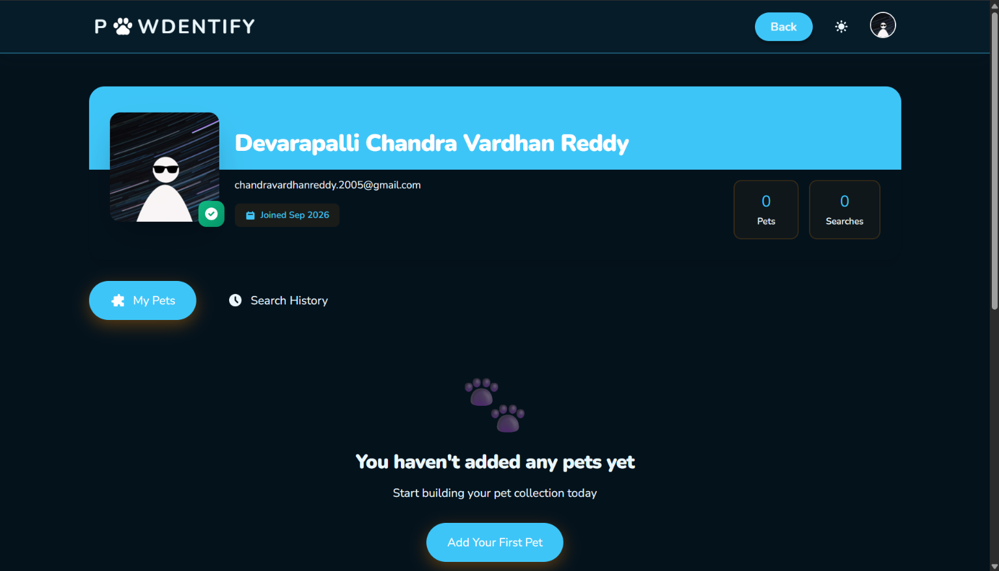
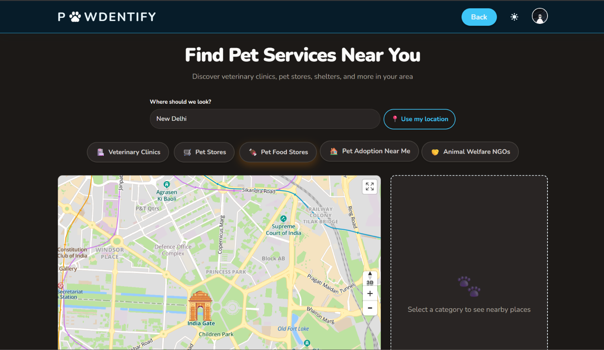

# 🐾 Pawdentify

**Identify any dog breed from a photo in under 3 seconds.**

Pawdentify is a full-stack web application that combines a deep-learning image
classifier trained on **120 dog breeds** with a rich, dog-themed UI for breed
exploration, pet management, and nearby-service discovery.


---

## ✨ Features

| Feature | Description |
|---------|-------------|
| **Breed Identification** | Upload or drag-drop a photo → get breed name + confidence score with a celebratory result view |
| **120-Breed Database** | Searchable library with fuzzy search (Fuse.js), breed detail tabs, image galleries, and size/temperament filters |
| **Dashboard** | Prediction history, pet profiles with notes & milestones, and adoption resources (sign-in required) |
| **Vet & Services Locator** | Mappls-powered map to find veterinary clinics, pet stores, food stores, shelters, and NGOs nearby |
| **Location Search** | Manual search by city/area/pincode + explicit "Use my current location" button; last location persisted per session |
| **Light & Dark Mode** | Full theme toggle with CSS custom properties; persisted to localStorage |
| **Prediction Guidelines** | Interactive do's/don'ts cards guiding users for better photo quality |
| **Feedback System** | Users can upvote/downvote predictions and leave text feedback |
| **Admin Panel** | View and manage all user feedback (protected route) |
| **Responsive Design** | Mobile-first, works on all screen sizes |
| **Internationalization** | English supported; i18next framework ready for Hindi, Urdu, French |
| **Clerk Authentication** | Sign in / sign up with SSO support |

### 🎨 Design

The UI uses a custom "Pawdentify Pastel" palette designed to feel clean and
approachable:

| Token | Hex | Usage |
|-------|-----|-------|
| `--text` | `#031a26` | Body text, headings |
| `--background` | `#fafdff` | Page backgrounds |
| `--primary` | `#1eb5eb` | Buttons, links, active states |
| `--secondary` | `#8684f5` | Accents, gradients |
| `--accent` | `#7e51f0` | Decorative highlights |

Dark mode swaps to complementary values automatically via CSS custom properties.

---

## 🏗️ Architecture

### System Overview



### Prediction Flow



### Project Structure

```
pawdentify/
├── frontend/
│   ├── src/
│   │   ├── assets/             # Images, icons, paw prints
│   │   ├── components/         # Reusable UI components
│   │   │   ├── Header.jsx          # Nav, auth dropdown, theme toggle
│   │   │   ├── HeroSection.jsx     # Landing hero with stat cards
│   │   │   ├── PredictionUpload.jsx # Drag-drop upload + predict flow
│   │   │   ├── PredictionGuidelines.jsx # Do's/Don'ts cards
│   │   │   ├── BreedInfoDisplay.jsx # Post-prediction breed info
│   │   │   ├── BreedTabs.jsx       # Tabbed breed details
│   │   │   ├── BreedCard.jsx       # Breed grid card
│   │   │   ├── BreedDetailModal.jsx # Full breed detail modal
│   │   │   ├── Settings.jsx        # User preferences
│   │   │   ├── Footer.jsx          # Footer with paw animation
│   │   │   ├── LoadingSpinner.jsx  # Paw-bounce loading
│   │   │   ├── FeedbackForm.jsx    # Prediction feedback
│   │   │   └── cards/              # InfoCard, AccordionCard, etc.
│   │   ├── pages/              # Route-level page components
│   │   │   ├── Dashboard.jsx       # History + pet profiles
│   │   │   ├── SearchBreed.jsx     # Breed database search
│   │   │   ├── Services.jsx        # Mappls vet/service locator
│   │   │   ├── FAQ.jsx             # FAQ accordion
│   │   │   ├── AdminFeedback.jsx   # Admin feedback panel
│   │   │   ├── SignInPage.jsx      # Clerk sign-in
│   │   │   └── SignUpPage.jsx      # Clerk sign-up
│   │   ├── contexts/           # ThemeContext (light/dark toggle)
│   │   ├── locales/            # i18n translation files (en.json)
│   │   ├── data/               # Static breed image mappings
│   │   ├── utils/              # Helper utilities
│   │   ├── App.jsx             # Router + layout
│   │   ├── index.css           # CSS custom properties (theme)
│   │   ├── i18n.js             # i18next configuration
│   │   └── main.jsx            # React entry point
│   ├── .env                    # Frontend env vars
│   ├── package.json
│   └── tailwind.config.js
├── backend/
│   ├── app/
│   │   ├── main.py             # FastAPI app, /predict, /breeds, /model_status
│   │   ├── preprocessing.py    # Image preprocessing + model loading
│   │   ├── database.py         # MongoDB connection (motor)
│   │   ├── auth.py             # Clerk JWT verification
│   │   ├── cloudinary_config.py # Cloudinary setup
│   │   ├── breed_info_final.json # 120-breed metadata
│   │   ├── model/              # Trained model weights
│   │   └── routes/
│   │       ├── breeds.py       # Breed CRUD & search
│   │       ├── history.py      # Prediction history
│   │       ├── pets.py         # Pet profile management
│   │       ├── places.py       # Mappls proxy (nearby/search)
│   │       ├── feedback.py     # User feedback
│   │       └── settings.py     # User preferences
│   ├── .env                    # Backend env vars
│   └── requirements.yml        # Conda environment spec
├── docs/
│   └── screenshots/            # UI screenshots (see below)
└── README.md
```

---

## 🚀 Getting Started

### Prerequisites

| Tool | Version |
|------|---------|
| **Node.js** | 18+ |
| **Python** | 3.10+ |
| **MongoDB** | Running locally or Atlas URI |
| **Clerk** | [Create an application](https://clerk.com) for auth keys |
| **Cloudinary** | [Sign up](https://cloudinary.com) for image storage |
| **Mappls** | [Get credentials](https://apis.mappls.com/console/) for map & places |

### 1. Clone the repository

```bash
git clone https://github.com/your-username/pawdentify.git
cd pawdentify
```

### 2. Set up the backend

```bash
cd backend
pip install uvicorn fastapi python-multipart motor "pyjwt[crypto]" python-dotenv cloudinary httpx tensorflow numpy pillow
```

Create `backend/.env`:

```env
# MongoDB
MONGODB_URI=mongodb://localhost:27017/pawdentify
DATABASE_NAME=pawdentify

# Clerk (get from Clerk dashboard → API Keys)
CLERK_SECRET_KEY=sk_test_...

# Cloudinary (get from Cloudinary dashboard)
CLOUDINARY_CLOUD_NAME=your_cloud_name
CLOUDINARY_API_KEY=your_api_key
CLOUDINARY_API_SECRET=your_api_secret

# Mappls (get from https://apis.mappls.com/console/)
MAPPLS_CLIENT_ID=your_client_id
MAPPLS_CLIENT_SECRET=your_client_secret


# Model
MODEL_PATH=./app/model/best_model_finetuned_mixup.pth
CONFIDENCE_THRESHOLD=0.4
```

Start the API server:

```bash
python -m uvicorn app.main:app --reload --host 127.0.0.1 --port 8000
```

### 3. Set up the frontend

```bash
cd frontend
npm install
```

Create `frontend/.env`:

```env
VITE_API_URL=http://localhost:8000
VITE_CLERK_PUBLISHABLE_KEY=pk_test_...
VITE_MAPPLS_MAP_SDK_KEY=your_mappls_map_sdk_key
```

Start the dev server:

```bash
npm run dev
```

Open **http://localhost:5173** in your browser.

---

## 📸 Screenshots

> Screenshots are stored in `docs/screenshots/`. Run the app locally and capture
> the screens listed below, or drop the images into that folder and they'll
> render automatically here.

| Screen | File |
|--------|------|
| Landing page (dark) |  |
| Upload & predict |  |
| Prediction result |  |
| Breed search |  |
| Breed detail |  |
| Dashboard |  |
| Vet locator |  |

---

## 🔌 API Endpoints

| Method | Path | Auth | Description |
|--------|------|------|-------------|
| `GET` | `/breeds` | — | List all 120 breeds with IDs and names |
| `GET` | `/model_status` | — | Check if the classifier model is loaded |
| `POST` | `/predict` | — | Upload an image → get breed prediction |
| `GET/POST` | `/api/history/*` | Clerk | User prediction history |
| `GET/POST/DELETE` | `/api/pets/*` | Clerk | Pet profile CRUD |
| `GET` | `/api/places/nearby` | Clerk | Nearby places via Mappls |
| `GET` | `/api/places/search` | Clerk | Search places by keyword |
| `POST` | `/api/feedback` | Clerk | Submit prediction feedback |
| `GET` | `/api/feedback` | Admin | View all feedback |
| `GET/POST` | `/api/settings/*` | Clerk | User preference CRUD |
| `GET` | `/api/breeds/*` | — | Breed detail data |

---

## 🛠️ Useful Commands

```bash
# Frontend
cd frontend
npm run dev       # Start dev server (port 5173)
npm run build     # Production build
npm run lint      # ESLint check

# Backend
cd backend
python -m uvicorn app.main:app --reload --port 8000   # Dev server
```

---

## 📋 Tech Stack

| Layer | Technology |
|-------|-----------|
| **Frontend** | React 19, Vite 7, Tailwind CSS 4, Framer Motion 12, React Router 7 |
| **Auth** | Clerk (React SDK + JWT verification) |
| **Icons** | Lucide React |
| **Search** | Fuse.js (client-side fuzzy search) |
| **i18n** | i18next + react-i18next |
| **Maps** | Mappls Web Maps SDK |
| **Backend** | FastAPI, Uvicorn |
| **Database** | MongoDB (via Motor async driver) |
| **Image Storage** | Cloudinary |
| **ML** | Deep learning image classifier (120 breeds) |
| **Places API** | Mappls Places (nearby + text search) |

---

## 🗺️ Roadmap

- [ ] Multi-breed detection in a single photo
- [ ] Breed comparison tool
- [ ] Pet health tracking timeline
- [ ] Community forum
- [ ] Additional language packs (Hindi, Urdu, French)
- [ ] PWA support for offline breed browsing

---

Built with ❤️ for dog lovers everywhere.
